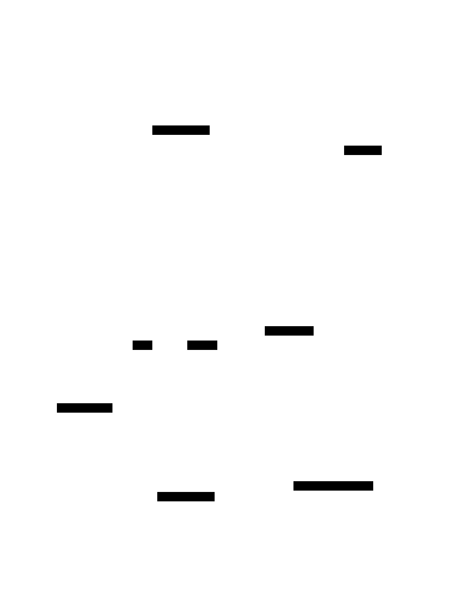

A small example to generate realistic Hasura schemas.

## Entity Relationship Diagram



## Tasks

### start

Start Hasura

```shell
docker compose up --detach
```

### console

Launch the Hasura Console UI

```shell
hasura console --project hasura
```
